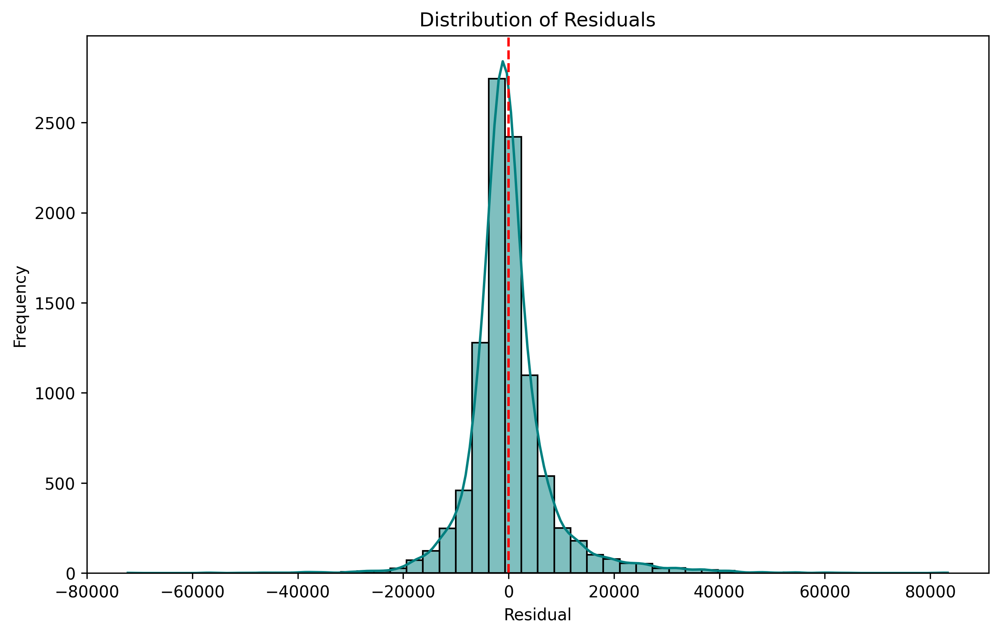
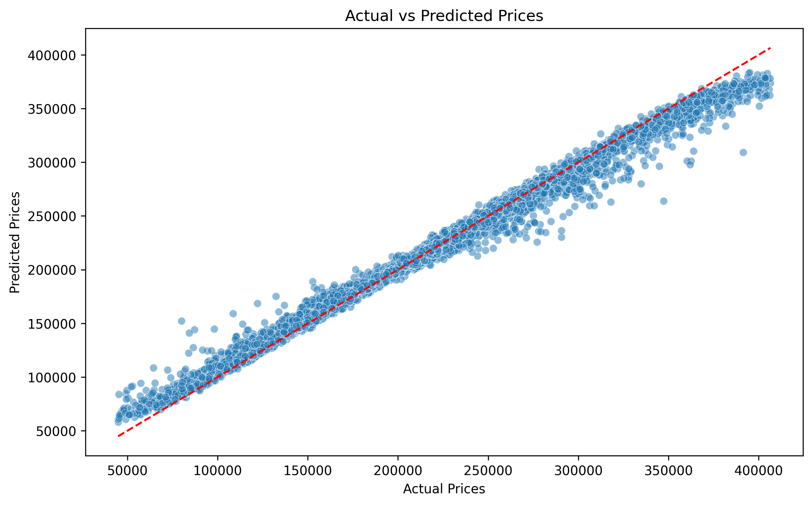

# Housing-Price-Prediction

Predict housing prices using a **Random Forest Regressor** on a limited-feature dataset.

## Overview

This project explores the problem of estimating house sale prices from basic property attributes. We clean and enrich the data, build and tune a Random Forest model, and evaluate its performance.

---

## Technologies & Libraries

- **Language:** Python  
- **Data & ML:** Pandas, NumPy, Scikit-Learn  
- **Visualization:** Matplotlib, Seaborn  
- **Persistence:** Joblib  
- **Notebook Development:** Jupyter (EDA.ipynb, model.ipynb)  

--------------

- **MAE:** 39,595.41  
- **MSE:** 2,429,087,107.94  
- **RMSE:** 49,285.77  
- **R²:** 0.56  

> **Note:** The R² value of approximately 0.56 is moderate. This indicates that the model is explaining only 56% of the variance in housing prices. The relatively low R² is due to the **limited features** in the dataset, rather than a flaw in the model itself. For improved accuracy, richer features should be added.

## Visualizations

### Distribution of Residuals  
  

### Actual vs. Predicted Prices  
  

