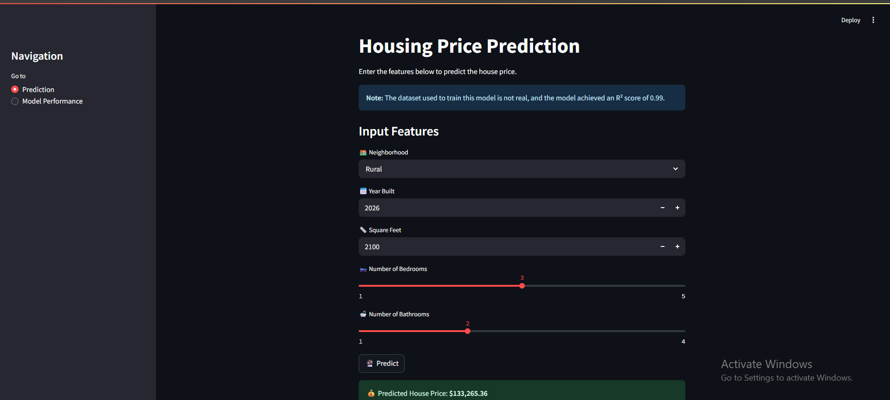

# Housing-Price-Prediction

Predict housing prices using a **Random Forest Regressor** on a limited-feature dataset.

## Overview

This project explores the problem of estimating house sale prices from basic property attributes. We clean and enrich the data, build and tune a Random Forest model, and evaluate its performance.

> **Note:** The dataset used in this project is not real and was created for demonstration purposes only.

---

## App Preview

Below is a preview of the app interface:

---

## Technologies & Libraries

- **Language:** Python  
- **Web App Framework:** Streamlit  
- **Data & ML:** Pandas, NumPy, Scikit-Learn  
- **Visualization:** Matplotlib, Seaborn  
- **Persistence:** Joblib  
- **Notebook Development:** Jupyter (EDA.ipynb)  

---

## Model Performance

- **Best R² (CV):** 0.9969650705040387  
- **MAE:** 5,007.85  
- **MSE:** 64,689,628.91  
- **RMSE:** 8,042.99  
- **R²:** 0.99  

> **Note:** The model achieved an excellent R² score of 0.99, indicating that it explains 99% of the variance in housing prices. This high performance is due to effective feature engineering and hyperparameter tuning.

---

## Visualizations

### Distribution of Residuals  
  

### Actual vs. Predicted Prices  
